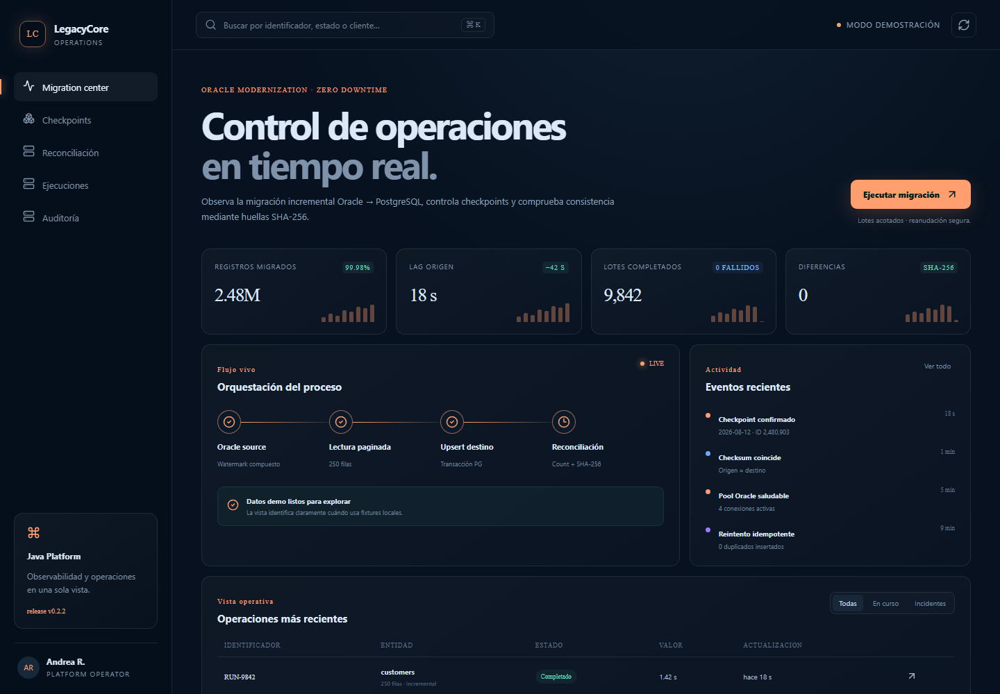
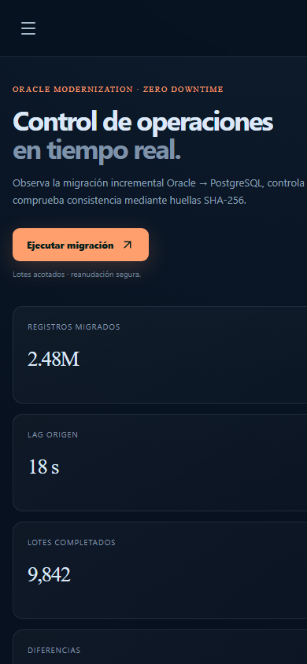

<p align="center">
  
</p>

<h1 align="center">LegacyCore Modernization Service</h1>

<p align="center"><i>Migración incremental Oracle → PostgreSQL con checkpoints,
reanudación y reconciliación verificable.</i></p>

<p align="center">
  <a href="https://github.com/danielyatacoblas/legacycore-modernization-service/actions/workflows/ci.yml"></a>
  
  
  
  
  
  
  <a href="LICENSE"></a>
</p>

---

## Qué es

Una migración empresarial rara vez cabe en una ventana de mantenimiento. Si el
proceso mueve millones de registros y falla en el lote 9842, volver a comenzar
es caro; continuar sin saber qué quedó confirmado es peligroso.

**LegacyCore implementa una modernización incremental y reanudable.** Lee
Oracle con un watermark compuesto `(updated_at, customer_id)`, transforma a
un modelo controlado, ejecuta upsert en PostgreSQL y avanza el checkpoint en la
misma transacción. Una reconciliación posterior compara cantidad y SHA-256
canónico entre origen y destino.

---

## Probar la consola sin Oracle

```bash
git clone https://github.com/danielyatacoblas/legacycore-modernization-service.git
cd legacycore-modernization-service/frontend
npm ci
npm run dev
```

Abrir `http://localhost:5177`. Las ejecuciones, checksums y registros son
sintéticos; la UI indica que funciona en modo demostración.

---

## Funcionalidades

1. Lectura incremental con watermark compuesto y orden estable.
2. Lotes acotados por `batchSize` y `maxBatches`.
3. Upsert idempotente en PostgreSQL.
4. Checkpoint y datos confirmados dentro de una única transacción.
5. Historial de ejecuciones completadas o fallidas.
6. Reconciliación por cantidad y SHA-256 canónico.
7. Errores REST con `ProblemDetail` RFC 9457.
8. Health, Prometheus, Dockerfile, unidad systemd y consola React.

---

## Capturas

| Escritorio | Móvil |
|---|---|
|  |  |

---

## Arquitectura y recorrido

<p align="center">
  
</p>

<p align="center">
  
</p>

La explicación ampliada está en [`docs/ARCHITECTURE.md`](docs/ARCHITECTURE.md).

---

## Decisiones de diseño

- **Watermark compuesto:** el timestamp solo no distingue filas actualizadas en
  el mismo instante.
- **Checkpoint transaccional:** nunca declara procesado un lote cuyo upsert no
  quedó confirmado.
- **Upsert idempotente:** repetir el lote después de una caída converge al
  mismo estado.
- **Límites por ejecución:** el operador controla cuánto trabajo realiza cada
  llamada.
- **Checksum canónico:** compara contenido estable, no orden accidental ni
  representación específica del driver.
- **Operación Linux incluida:** el repositorio contiene Dockerfile y unidad
  systemd, no solo código de aplicación.

---

## Demo completa

Requiere Java 21, Docker y Node.js 24.

```bash
docker compose up -d --wait
./gradlew bootRun
```

Compose inicia Oracle con tres clientes ficticios y PostgreSQL. La API queda en
`http://localhost:8095`.

```bash
curl -X POST http://localhost:8095/api/v1/migrations/customers +  -H "Content-Type: application/json" +  -d '{"batchSize":2,"maxBatches":10}'

curl http://localhost:8095/api/v1/migrations/customers/status
curl http://localhost:8095/api/v1/reconciliation/customers
```

La reconciliación final debe devolver `"consistent": true`.

---

## API

| Método | Ruta | Uso |
|---|---|---|
| `POST` | `/api/v1/migrations/customers` | Ejecutar lotes |
| `GET` | `/api/v1/migrations/customers/status` | Checkpoint e historial |
| `GET` | `/api/v1/reconciliation/customers` | Conteos y checksums |
| `GET` | `/actuator/health` | Salud |
| `GET` | `/actuator/prometheus` | Métricas |

---

## Pruebas y comandos

```bash
./gradlew clean test bootJar --no-daemon
cd frontend && npm ci && npm test && npm run build
```

| Comando | Resultado |
|---|---|
| `docker compose up -d --wait` | Oracle y PostgreSQL de demo |
| `./gradlew bootRun` | API en 8095 |
| `./gradlew clean test` | Checksums y comportamiento Java |
| `pwsh scripts/verify.ps1` | Backend y frontend |
| `pwsh scripts/render-diagrams.ps1` | Diagramas reproducibles |

---

## Stack

| Capa | Tecnología |
|---|---|
| Backend | Java 21, Spring Boot 4.1, Spring JDBC |
| Origen | Oracle Free |
| Destino | PostgreSQL, Flyway |
| Integridad | Watermark, checkpoint, SHA-256 |
| Operación | Docker, Linux, systemd, Prometheus |
| Frontend | React 19, TypeScript 7, Vite 8 |
| Pruebas | JUnit, Spring Boot Test, Vitest |

---

## GitFlow

<p align="center">
  
</p>

El repositorio conserva releases en `main`, integración en `develop` y
ramas `feature/*`, `docs/*`, `fix/*`, `hotfix/*` y `release/*`.
Los merges son `--no-ff` y las versiones llevan tag.

---

## Estructura

```text
legacycore-modernization-service/
├── src/main/java/              # Lectura, migración, reconciliación y API
├── src/main/resources/         # Configuración y Flyway
├── src/test/                   # Checksum canónico
├── frontend/                   # Centro de migración React
├── docs/                       # Arquitectura e índice documental
├── infra/                      # Infraestructura asociada
├── ops/                        # Unidad systemd
├── diagrams/                   # Mermaid y renders
├── scripts/                    # Verificación y diagramas
├── Dockerfile
└── compose.yaml                # Oracle + PostgreSQL
```

---

## Autor

[Daniel Yataco Blas](https://github.com/danielyatacoblas) — autor principal
del diseño, implementación, pruebas y documentación.

## Licencia

[MIT](LICENSE) · Daniel Yataco Blas
